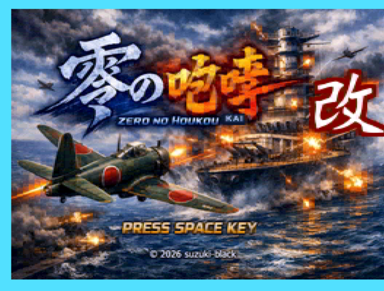
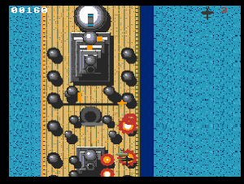

# 零の咆哮 改 / ZERO NO HOUKOU KAI

<p align="center">
  
</p>

> ⚠️ **This is a prototype** (**v0.0.1**), published for feedback and experimentation.
> **試作品（プロトタイプ）です（v0.0.1）。** フィードバックと実験のために公開しています。

A single-player, vertically–scrolling shoot-'em-up for the **MSX turboR** (V9958 VDP · Z80/R800),
built as a ground-up successor to *Zero no Houkou*. Fly a lone naval fighter from the open sea
into the guns of an enemy capital ship, and take the whole vessel apart, emplacement by emplacement.

**Repository:** <https://github.com/suzuki-black/BattleshipProtoR> — currently private; it will be made
public once ready. This game is an **improved successor to
[BattleshipProto](https://github.com/suzuki-black/BattleshipProto)** (private).

<p align="center">
  
  <br><sub>Stage 1 · battleship-mode combat / ステージ1 戦艦モードの激闘</sub>
</p>

**Language:** [🇬🇧 English](#english) · [🇯🇵 日本語](#japanese)

---

<a name="english"></a>
## English

- [Story](#story)
- [Overview](#overview)
- [Features](#features)
- [Controls](#controls)
- [Requirements](#requirements)
- [Building](#building)
- [Running](#running)
- [Project structure](#project-structure)
- [Documentation](#documentation)
- [Origin](#origin)
- [Feedback](#feedback--contributing)
- [Credits](#credits)
- [License](#license)
- [Disclaimer](#disclaimer)

### Story

> The samurai was enraged. He resolved that he must, without fail, rid the world of its wars.
> He knows nothing of politics. He is but a man of the blade, who has lived by honing his sword and
> playing in the wind. Before dawn today he left his homeland; crossing clouds and waves — not ten
> leagues but hundreds of sea-miles away — he came to this battlefield upon the sea. He has no
> father, no mother, and no wife. He carries only a single sword, and a vow to the comrades who
> will not return.

### Overview
- **Platform:** MSX turboR software (256 KB ASCII8 mega-ROM). It also boots on an MSX2+, but with
  degraded speed/timing (the engine assumes the R800).
- **Genre:** Single-player vertical shoot-'em-up.
- **Structure:** One continuous scroll per stage — no hard screen cuts. Each stage opens over open
  water (an aerial dogfight), then flows seamlessly into a battle against a slowly weaving capital
  ship that you must destroy completely.

### Features
- **Fully destructible ship:** every main turret *and* every anti-aircraft mount can be shot away;
  a stage is cleared only when the whole ship is silenced. Destroyed emplacements keep burning as
  the ship scrolls.
- **5 stages / bosses:** Bismarck-class battleship → Essex-class carrier → HMS Hood battlecruiser →
  Nelson & Rodney twin battleships → USS Iowa-class fast battleship. Sea-intro fighters are
  contemporary aircraft chosen to match each ship's navy.
- **V9958 R#23 hardware vertical scroll** plus a **pseudo multi-scroll sea** — a fast engine with
  no full-screen redraw.
- **Rotating, aiming main guns** rendered as shaded sprites that track the player.
- **Ship-specific weapons** so each boss fights differently.
- **H.TIMI 60 Hz interrupt PSG sound driver** (frame-rate independent), with per-stage **original
  music** — every track is composed for this game and is **not** derived from any existing work —
  a two-tier soundtrack (calm sea intro → stage battle theme) and a victory fanfare.
- **Difficulty scaling, hit-stop and screen-shake feedback, a high-score, and a "rage" escalation**
  when a ship is nearly destroyed.

### Controls
| Input | Action |
|-------|--------|
| Arrow keys / joystick | Move |
| Space / trigger A (keyboard **A**) | Fire · confirm |
| Keyboard **B** / trigger 2 | Sub-trigger |

### Requirements
- **Target hardware:** MSX turboR (e.g. Panasonic FS-A1GT).
- **Also runs on:** MSX2+ (playable, but timing/speed are not tuned for it).
- The turboR system ROM is copyrighted and is **not** included; for development this project is
  verified under the **C-BIOS MSX2+** machine in [openMSX](https://openmsx.org/).

### Building
Requires [SDCC](https://sdcc.sourceforge.net/) and Node.js.

```bash
make
```

This produces `GAME.ROM` (a 256 KB ASCII8 mega-ROM).

### Running
Under openMSX:

```bash
openmsx -machine C-BIOS_MSX2+_JP -carta GAME.ROM -romtype ASCII8
```

`GAME.ROM` also runs in [WebMSX](https://webmsx.org/) (drag-and-drop) and on real MSX2+/turboR
hardware.

### Project structure
```
src/core/      resident engine (VDP, entity pool, scroll, sound, HUD, input, collision)
src/scenes/    scene FSM (stage) — the per-frame game loop
src/banked/    cold banked scenes (title/config/ending/ship render), bcall trampoline
src/include/   headers
src/crt0rom.s  ROM boot / ASCII8 mapper init / BSS clear
tools/         gen_assets.mjs (BGM & asset packer), rompack.mjs (mega-ROM packer)
docs/          design & development notes
```

### Documentation
- **[Algorithm notes / 各処理アルゴリズム解説](docs/アルゴリズム解説.md)** — the algorithm chosen
  per subsystem, why, and its measured effect (mostly speed). A reusable playbook for building a
  fast turboR vertical shooter.
- **[Development notes / 開発で苦労したこと](docs/苦労したこと.md)** — misdiagnoses, traps, and
  root-cause hunts, with the lessons learned.

### Origin
The **prototype was first built in [Function BASIC](https://github.com/suzuki-black/FunctionBASIC)**;
this repository is a ground-up turboR rewrite
in C + Z80/R800 assembly (SDCC). The goal was a *1943*-style arcade vertical shooter — WWII aircraft
vs. capital ships. That theme fell out naturally: the graphics are produced with AI, and the quickest
way to get the shapes right was to have it work from real **blueprints**, which had to be
**public-domain** — and those turned out to be WWII ships and aircraft. *1943* ran on then-monster
arcade hardware, and no MSX could ever rival a board that moved whole battleships as sprites. It
cannot hope to *surpass* Capcom's *1943* — but it is an earnest, flagship attempt to get even a
little closer to the thrill of playing it. The two documents above describe the algorithms and the
struggles of getting that arcade feel onto the turboR.

### Feedback & Contributing
This is an experimental prototype released for feedback. Once the repository is public, please use
GitHub Issues to report bugs or share impressions. Pull requests are welcome for clearly-scoped fixes.

### Credits
- **Original Concept / Direction:** suzuki-black
- **Program / Graphics:** Claude Code (Anthropic Claude)
- **Sound (music & SFX):** Claude Code (Anthropic Claude) — all original, not copied from any existing work
- **Title illustration:** Microsoft Copilot × Claude Code (Anthropic Claude) — a collaboration

### License
**MIT** © 2026 suzuki-black. See [LICENSE](LICENSE). **Everything in this repository — code, graphics,
and music — is released under the MIT license.** All assets are original works created for this game;
no rights are reserved beyond the MIT terms.

The ships and aircraft that appear are real historical equipment; no specific game's names,
characters, images, or audio are used.

### Disclaimer
The weapons, ships, and aircraft in this game are fiction that merely borrows historical names.
They are **not** intended as accurate depictions of real equipment; their shapes, colors, and
performance have been altered for the sake of the game. (Hardware limits of the MSX also mean
silhouettes may differ from the real thing.)

---

<a name="japanese"></a>
## 日本語

- [あらすじ](#あらすじ)
- [概要](#概要)
- [特徴](#特徴)
- [操作](#操作)
- [動作環境](#動作環境)
- [ビルド](#ビルド)
- [実行](#実行)
- [ディレクトリ構成](#ディレクトリ構成)
- [ドキュメント](#ドキュメント)
- [開発の背景](#開発の背景)
- [フィードバック](#フィードバック)
- [クレジット](#クレジット)
- [ライセンス](#ライセンス)
- [免責](#免責)

### あらすじ

> 古武士は激怒した。必ず、かの世の戦乱を除かなければならぬと決意した。古武士には政治がわからぬ。
> 古武士は、ひとりの武辺者である。刃を研ぎ、風と遊んで暮して来た。きょう未明古武士は故郷を発ち、
> 雲を越え波を越え、十里どころか遥か幾百海里を隔てた此の海上の激戦地にやって来た。古武士には
> 父も、母も無い。女房も無い。ただ一振りの刀と、還らぬ戦友らへの誓ひばかりを抱いてゐる。

### 概要
- **対応機種:** MSX turboR 用ソフト（256KB の ASCII8 メガROM）。MSX2+ でも起動はしますが、速度・
  タイミングを R800 前提で設計しているため動作に難ありです。
- **ジャンル:** 1人用・縦スクロールシューティング。
- **構成:** 1ステージ＝画面カットの無い地続きの縦スクロール。海（空戦）で始まり、そのまま蛇行する
  敵大型艦との戦闘へ接続。艦を**完全に撃破**するとクリアです。

### 特徴
- **艦は全破壊可能:** 主砲だけでなく対空砲まで、艦上の火点をすべて撃ち落とせます。艦全体を沈黙
  させて初めてクリア。撃破した火点はスクロール中も燃え続けます。
- **全5ステージ／ボス:** ビスマルク級 戦艦 → エセックス級 空母 → HMS フッド 巡洋戦艦 →
  ネルソン&ロドニー 双子戦艦 → USS アイオワ級 高速戦艦。海イントロの戦闘機は各艦の所属海軍に
  合わせた当時の典型機です。
- **V9958 の R#23 垂直ハードウェアスクロール**＋**海の疑似多重スクロール**。全画面再描画ゼロの
  高速エンジン。
- **狙って旋回する主砲**（行別カラーで陰影を付けたスプライト砲身が自機を追尾）。
- **艦種ごとに異なる固有兵装**でボス戦の性格が変わります。
- **H.TIMI 60Hz 割込みで回すフレームレート非依存の PSG 音ドライバ**。面別の**オリジナル楽曲**
  （すべて本作のための書き下ろしで、既存楽曲を元にしたものではありません）、2段構成のサウンド
  （穏やかな海イントロ→各面の戦闘曲）、勝ちどきのファンファーレ。
- **難易度スケーリング／被弾・撃破のヒットストップと画面揺れ／ハイスコア／艦が残り僅かになると
  発砲が激化するレイジ**。

### 操作
| 入力 | 動作 |
|------|------|
| カーソルキー／ジョイスティック | 移動 |
| スペース／トリガーA（キーボード **A**） | 発射・決定 |
| キーボード **B**／トリガー2 | サブトリガー |

### 動作環境
- **対象実機:** MSX turboR（例: Panasonic FS-A1GT）。
- **参考動作:** MSX2+（一応プレイ可能ですが、速度・タイミングは最適化していません）。
- turboR 本体 ROM は著作物のため**同梱していません**。開発時の検証は
  [openMSX](https://openmsx.org/) の **C-BIOS MSX2+** マシンで行っています。

### ビルド
[SDCC](https://sdcc.sourceforge.net/) と Node.js が必要です。

```bash
make
```

`GAME.ROM`（256KB の ASCII8 メガROM）が生成されます。

### 実行
openMSX での実行:

```bash
openmsx -machine C-BIOS_MSX2+_JP -carta GAME.ROM -romtype ASCII8
```

`GAME.ROM` は [WebMSX](https://webmsx.org/)（ドラッグ&ドロップ）や実機（MSX2+／turboR）でも動作します。

### ディレクトリ構成
```
src/core/      常駐エンジン(VDP/エンティティプール/スクロール/音/HUD/入力/当たり判定)
src/scenes/    シーンFSM(ステージ) — 毎フレームのゲームループ
src/banked/    冷たいバンクシーン(タイトル/設定/エンディング/艦描画)、bcallトランポリン
src/include/   ヘッダ
src/crt0rom.s  ROM起動 / ASCII8マッパー初期化 / BSSゼロ化
tools/         gen_assets.mjs(BGM・アセットのパック), rompack.mjs(メガROM生成)
docs/          設計・開発ノート
```

### ドキュメント
- **[各処理アルゴリズム解説](docs/アルゴリズム解説.md)** — 各処理でどのアルゴリズムを選び、なぜ、
  どれだけ効いたか（多くは速度改善）を実測値つきで記述。**次の高速な縦STGを作るための土台**。
- **[開発で苦労したこと](docs/苦労したこと.md)** — 誤診・地雷・原因究明の記録と教訓。

### 開発の背景
**原型（プロトタイプ）は [Function BASIC](https://github.com/suzuki-black/FunctionBASIC) で作成**
しました。本リポジトリはそれを土台に MSX turboR
専用エンジンとして C＋Z80/R800 アセンブラ（SDCC）で一から作り直したものです。きっかけは
「**1943 のようなアーケード縦シューティングを作りたい**」でした。グラフィックは AI に描かせて
おり、狙った形を描かせる一番手っ取り早い方法が「**実物の図面（三面図など）を参照させる**」こと
でしたが、参照する図面は権利上**パブリックドメインである必要**があり、その条件を満たすのが結果
的に第二次大戦期の艦船・航空機だったため、**自ずと 1943 的な題材**に落ち着きました。1943 は
オールドアーケードながら**当時としては“化け物スペック”の基板**で動いた作品で、戦艦をまるごと
スプライトで動かすような基板に MSX が敵うはずもありません。本作は、**凌駕は叶わないまでも、あの
カプコン『1943』を遊んだときの感動に少しでも近づくための“本命作”**です。アーケードらしい手応えを
turboR で成立させるために何をしたかは、上のドキュメントにまとめています。

### フィードバック
本作はフィードバックのために公開している実験的な試作品です。リポジトリ公開後は、不具合報告や
感想は GitHub Issues でお願いします。範囲の明確な修正の Pull Request も歓迎します。

### クレジット
- **原案・ディレクション:** suzuki-black
- **プログラム／グラフィック:** Claude Code（Anthropic Claude）
- **サウンド（BGM・効果音）:** Claude Code（Anthropic Claude）― すべてオリジナル。既存楽曲のコピーではありません。
- **タイトルイラスト:** Microsoft Copilot × Claude Code（Anthropic Claude）の合作

### ライセンス
**MIT** © 2026 suzuki-black. 詳細は [LICENSE](LICENSE) を参照。**コード・グラフィック・音楽を含む
本リポジトリのすべてを MIT ライセンスで公開**します（いずれも本作のために制作したオリジナルで、
MIT の条件を超える権利主張はしません）。

登場する軍艦・航空機は実在の史実兵器で、特定ゲーム作品の名称・キャラクター・画像・音源は一切
使用していません。

### 免責
本作の兵器・艦船・航空機は、史実の名称を借りたフィクションです。実在兵器の正確な描写を意図した
ものでは**なく**、形状・色・性能はゲームのために改変しています。（MSX のハード制約により、実物と
シルエットが異なる場合もあります。）

